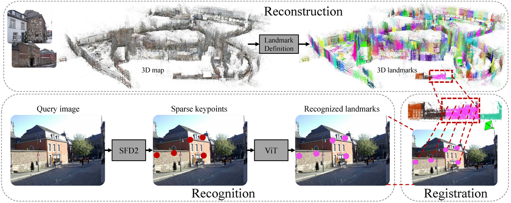

## PRAM: Place Recognition Anywhere Model for Efficient Visual Localization

<p align="center">
  
</p>

Humans localize themselves efficiently in known environments by first recognizing landmarks defined on certain objects
and their spatial relationships, and then verifying the location by aligning detailed structures of recognized objects
with those in the memory. Inspired by this, we propose the place recognition anywhere model (PRAM) to perform visual
localization as efficiently as humans do. PRAM consists of two main components - recognition and registration. In
detail, first of all, a self-supervised map-centric landmark definition strategy is adopted, making places in either
indoor or outdoor scenes act as unique landmarks. Then, sparse keypoints extracted from images, are utilized as the
input to a transformer-based deep neural network for landmark recognition; these keypoints enable PRAM to recognize
hundreds of landmarks with high time and memory efficiency. Keypoints along with recognized landmark labels are further
used for registration between query images and the 3D landmark map. Different from previous hierarchical methods, PRAM
discards global and local descriptors, and reduces over 90% storage. Since PRAM utilizes recognition and landmark-wise
verification to replace global reference search and exhaustive matching respectively, it runs 2.4 times faster than
prior state-of-the-art approaches. Moreover, PRAM opens new directions for visual localization including multi-modality
localization, map-centric feature learning, and hierarchical scene coordinate regression.

* Full paper PDF: [Place Recognition Anywhere Model for Efficient Visual Localization](assets/pram.pdf).

* Authors: *Fei Xue, Ignas Budvytis, Roberto Cipolla*

* Website: [PRAM](https://feixue94.github.io/pram-project) for videos, slides, recent updates, and datasets.

## Key Features

### 1. Self-supervised landmark definition on 3D space

- No need of segmentations on images
- No inconsistent semantic results from multi-view images
- No limitation to labels of only known objects
- Work in any places with known or unknown objects

### 2. Efficient landmark-wise coarse and fine localization

- Recognize landmarks as opposed to do global retrieval
- Local landmark-wise matching as opposed to exhaustive matching
- No global descriptors (e.g. NetVLAD)
- No reference images and their heavy repetative 2D keypoints and descriptors

### 3. Landmark-wise map sparsification

- Tack each landmark for localization
- Reduce redundant 3D points for each landmark independently

### 4. Sparse recognition

- Sparse SFD2 keypoints as tokens
- No uncertainties of points at boundaries
- Automatic inlier/outlier discrimination

### 5. Relocalization and temporal localization

- Per frame reclocalization from scratch
- Tracking previous frames for higher efficiency

### 6. One model one dataset

- All 7 subscenes in 7Scenes dataset share a model
- All 12 subscenes in 12Scenes dataset share a model
- All 5 subscenes in CambridgeLandmarks share a model

## Open problems

- Adaptive number landmarks determination
- Using SAM + open vocabulary to generate semantic map
- Multi-modality localization with other tokenized signals (e.g. text, language, GPS, Magonemeter)
- More effective solutions to 3D sparsification

## Preparation

1. Download the 7Scenes, 12Scenes, CambridgeLandmarks, and Aachen datasets (remove redundant depth images otherwise they
   will be found in the sfm process)
2. Environments
   2.1 Create a virtual environment

```
conda env create -f environment.yml
conda activate pram
```

2.2 Compile Pangolin for the installed python

```
git clone --recursive https://github.com/stevenlovegrove/Pangolin.git
cd Pangolin
git checkout v0.8

# Install dependencies
./scripts/install_prerequisites.sh recommended

# Compile with your python
cmake -DPython_EXECUTABLE=/your path to/anaconda3/envs/pram/bin/python3  -B build
cmake --build build -t pypangolin_pip_install
```

## Run the localization with online visualization

1. Download the [3D-models](https://drive.google.com/drive/folders/1DUB073KxAjsc8lxhMpFuxPRf0ZBQS6NS?usp=drive_link)
   obtained with SFD2
   keypoints,
   pretrained [models](https://drive.google.com/drive/folders/1E2QvujCevqnyg_CM9FGAa0AxKkt4KbLD?usp=drive_link) ,
   and [landmarks](https://drive.google.com/drive/folders/1r9src9bz7k3WYGfaPmKJ9gqxuvdfxZU0?usp=sharing)
2. Put pretrained models in ```weights``` directory
3. Run the demo (e.g. 7Scenes)

```
python3 inference.py  --config configs/config_train_7scenes_sfd2.yaml --rec_weight_path weights/7scenes_nc113_birch_segnetvit.199.pth  --landmark_path /your path to/landmarks --online
```

## Train the recognition model (e.g. for 7Scenes)

### 1. Do SfM with SFD2 including feature extraction (modify the dataset_dir, ref_sfm_dir, output_dir)

```
./sfm_scripts/reconstruct_7scenes.sh
```

This step will produce the SfM results together with the extracted keypoints

### 2. Generate 3D landmarks

```
python3 -m recognition.recmap --dataset 7Scenes --dataset_dir /your path to/7Scenes --sfm_dir /sfm_path/7Scenes --save_dir /save_path/landmakrs
```

This step will generate 3D landmarks, create virtual reference frame, and sparsify the 3D points for each landmark for
all scenes in 7Scenes

### 3. Train the sparse recognition model (one model one dataset)

```
python3 train.py   --config configs/config_train_7scenes_sfd2.yaml
```

Remember to modify the paths in 'config_train_7scenes_sfd2.yaml'

## Your own dataset

1. Run colmap or hloc to obtain the SfM results
2. Do reconstruction with SFD2 keypoints with the sfm from step as refernece sfm
3. Do 3D landmark generation, VRF, map sparsification etc (Add DatasetName.yaml to configs/datasets)
4. Train the recognition model
5. Do evaluation

## BibTeX Citation

If you use any ideas from the paper or code in this repo, please consider citing:

```
@inproceedings{xue2024pram,
  author    = {Fei Xue and Ignas Budvytis and Roberto Cipolla},
  title     = {PRAM: Place Recognition Anywhere Model for Efficient Visual Localization},
  year      = {2024}
}

@inproceedings{xue2023sfd2,
  author    = {Fei Xue and Ignas Budvytis and Roberto Cipolla},
  title     = {SFD2: Semantic-guided Feature Detection and Description},
  booktitle = {CVPR},
  year      = {2023}
}

@inproceedings{xue2022imp,
  author    = {Fei Xue and Ignas Budvytis and Roberto Cipolla},
  title     = {IMP: Iterative Matching and Pose Estimation with Adaptive Pooling},
  booktitle = {CVPR},
  year      = {2023}
}

@inproceedings{xue2022efficient,
  author    = {Fei Xue and Ignas Budvytis and Daniel Olmeda Reino and Roberto Cipolla},
  title     = {Efficient Large-scale Localization by Global Instance Recognition},
  booktitle = {CVPR},
  year      = {2022}
}
```

## Acknowledgements

Part of the code is from previous excellent works
including , [SuperGlue](https://github.com/magicleap/SuperGluePretrainedNetwork)
and [hloc](https://github.com/cvg/Hierarchical-Localization). You can find more details from their released
repositories if you are interested in their works. 